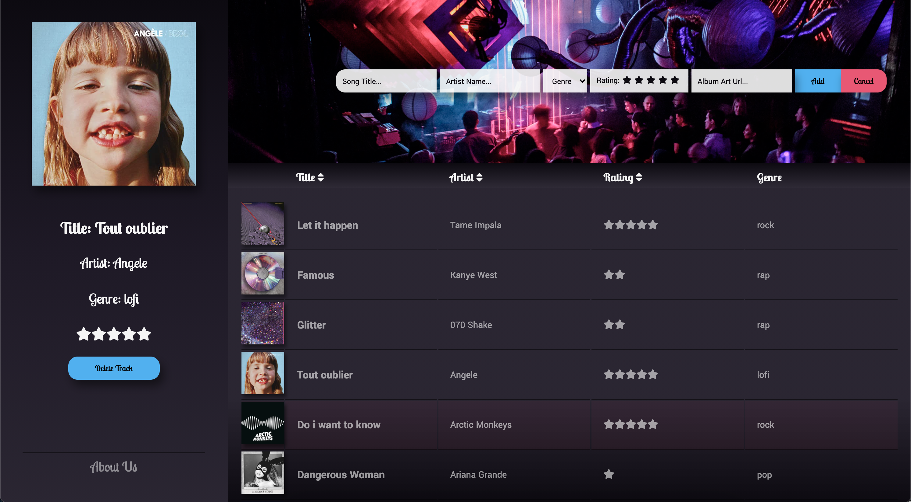

# Lil_Playlist
---

## Description 
A webapp to organise your music. 

## Languages, Libraries & Frameworks
* React
* Redux
* JavaScript 
* CSS
* HTML

## Setup 
1. Clone the repository to a local directory
2. cd into the directory and run `npm start` to run the app in development mode
3. run `npm run build` or `yarn build` to build the app for production

## Screenshots

## Live Demo 
https://hungry-jennings-92ae10.netlify.app

## Usage & Details 
The goal of this webapp is to make it easy to add and organise your music. 

* To add a new track, tap on the "add a song" button, fill in the track's info and press 'add'
* To view a track's info, tap on the desired playlist track and it will appear in the sidebar 
* To remove a track, first tap on the desired playlist track and then tap the "delete track" button in the sidebar 
* To sort your playlist by a title, artists or rating, tap on the desired word in the menu above the playlist  
If you tap the desired word again your playlist will get sorted in the reverse order
* To filter your playlist by a specific genre, tap the genre button in the menu above the playlist,  
and tap your desired genre(s) to include

## Issues/ Missing Features
* As a user i'd like to be able to edit a track's info after it's been added
* As a user i want the playlist to automatically search online and find matching album art when i fill in a track's title and artist
* As a user i'd like to add multiple tracks at once by selecting a music folder on my computer,  
the playlist should then automatically extract the song info for each mp3 file in my folder
* As a user when I double tap a track in the playlist, i'd like the playlist to play that track
